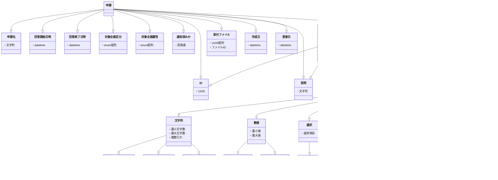

# sos24-client

[](https://github.com/sohosai/sos24-client/actions/workflows/cd-beta.yml)

雙峰祭オンラインシステムのクライアントです。

## 環境構築

### 環境変数

`.env.example`を参考にFirebase・バックエンドURLを設定します。

### セットアップ

`npm i`で依存関係がインストールされます。

`npm run dev`で開発用サーバが起動します。

### ビルド

`npm run build`でビルドできます

Cloudflare Pagesにデプロイする場合は`npx @cloudflare/next-on-pages@1`で静的アセットを生成できます。

## APIからのresponseにスキーマに応じた型を付ける方法

### SWRを使ってGETするとき編

```typescript
import { assignType } from "@/lib/openapi";

const newsId = "<uuid>";

const { data: newsRes, error: newsErr, isLoading } = useSWR(`/news/${newsId}`);
if (isLoading) {
  // 読み込み時の処理
}
if (newsErr) {
  // エラー時の処理
}
const news = assignType("/news/{news_id}", newsRes);
```

path parametersはurlに文字列として直接埋め込みます。

`assignType`には、openapiで定義されているパスと`newsRes`を渡します。

## APIを安全に叩く方法(post、putなど)

openapi-fetchを使います。

## ベータについて

[GitHub Actions](https://github.com/sohosai/sos24-client/actions/workflows/cd-beta.yml)を手動実行することでベータをデプロイできます。

## スキーマの更新

schema.ymlを更新したのち、以下のコマンドを実行してください

```shell
npm run gen
npm run format
```

現在はopenapi-typescriptのバグ（ https://github.com/drwpow/openapi-typescript/issues/1464
）により、正しい型定義が生成されません。そのため、以下のコマンドを実行して型定義を修正してください。

```shell
sed -i '/type: "FormItem";/d' ./src/schema.d.ts
sed -i '/type: "NewFormItem";/d' ./src/schema.d.ts
sed -i 's/Omit<components\["schemas"\]\["FormItemKind"\], "type">/components["schemas"]["FormItemKind"]/' ./src/schema.d.ts
```





